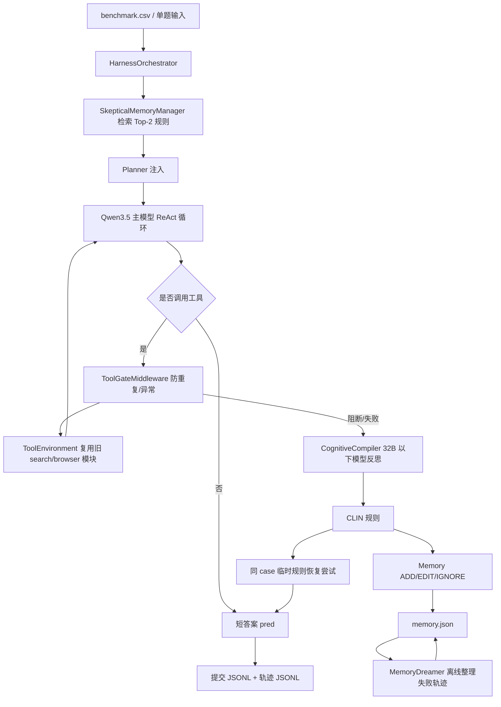

# 自进化任务求解 Agent 设计说明

## 目标

本实现的目标是在不改动原始代码的前提下，从 0 构建一个接口兼容的自进化任务求解 Harness。系统面向 `benchmark.csv`，支持文本题与 base64 图片题，复用现有搜索/浏览器服务，并通过轨迹、反思、记忆和物理门禁形成轻量进化闭环。

## 总体流程



## 模块职责

### HarnessOrchestrator

位置：`evo_agent/harness.py`

- 读取 `benchmark.csv`、SimpleVQA JSONL、2Wiki JSONL。
- 对 `benchmark.csv` 的 base64 图片进行本地落盘，同时保留原始 `image` 字段用于提交 JSONL。
- 驱动最多 `MAX_STEPS` 轮 OpenAI-compatible tool calling。
- 记录 system/user/assistant/tool/event 轨迹。
- 在失败、门禁阻断或答案不匹配时触发反思和记忆写入。
- 为刷榜稳定性默认启用单 case 反思恢复：首轮没有可解析 `pred` 时，先把失败轨迹编译成临时 CLIN 规则并追加短预算 ReAct 重试；默认至少给模型 5 次生成机会，仍失败则提交空 `pred`，不写入非模型兜底答案。

### ToolEnvironment

位置：`evo_agent/environment.py`

- 不复制旧浏览器代码，只懒加载根目录 `tools/browser_tool.py`。
- 不复制旧搜索代码，只懒加载根目录 `tools/search_tool.py`。
- 暴露与当前服务兼容的工具名：`search_text`、`search_image`、`browser_navigate`、`browser_get_text`、`browser_click`、`browser_type`、`browser_parallel`。
- `search_image` 同时兼容 `image` 与 `image_url` 参数。

### ToolGateMiddleware

位置：`evo_agent/gate.py`

- 参考 OpenClaw loop detection 的思路维护最近工具调用历史。
- 用 Jaccard 相似度检测参数微调式死循环。
- 对 401/403/auth/API key 等硬错误立即阻断。
- 对 timeout/500/session/proxy-error 等连续错误阻断，减少 token 浪费。

### CognitiveCompiler

位置：`evo_agent/compiler.py`

- 默认启发式反思；设置 `REFLECTION_MODEL_ENABLED=1` 后调用辅助模型。
- 辅助模型显式名称不得超过 32B，推荐 `qwen3-32b`。
- 输出结构化 reflection，并生成单行 CLIN 规则。
- 额外提供 `advise_memory_update()`，让 32B 以下模型辅助判断记忆操作：`ADD`、`EDIT`、`IGNORE`。

### SkepticalMemoryManager

位置：`evo_agent/memory.py`

- 长期记忆统一为 `skill`、`bad_pattern`、`reflection` 三类，均使用同一 schema：触发条件、任务类型、执行步骤、避免事项、来源和统计信息。
- Memory 不存完整轨迹，不存具体答案，只存可泛化经验。
- 检索采用 hybrid 策略：dense route 走可插拔 embedding 接口，默认本地 hash embedding；lexical route 走 `trigger_keywords` 碰撞；最终按向量相似度、任务类型、关键词、confidence、历史成功率 rerank。
- 记忆仅作为线索注入，不作为事实。
- 参考 ExpeL 的规则编辑思想，用 `ADD/EDIT/IGNORE` 管理新规则。
- 使用 usage log 和成功/失败反馈更新置信度：

```text
confidence = (success_count + 1) / (success_count + failure_count + 2)
```

- `usage_count >= 3` 且 `confidence < 0.30` 的记忆会标记为 `deprecated`，后续不再检索。

### MemoryDreamer

位置：`evo_agent/dreamer.py`

- 离线读取最近 `trajectories/*.jsonl`，筛选失败、空答案、门禁阻断或异常退出样本。
- 对失败轨迹调用 `CognitiveCompiler`，生成可迁移 CLIN 规则。
- 通过 `SkepticalMemoryManager.auto_dream_deduplication()` 合并、去重和裁剪规则。
- 写出 `dream_report.json`，记录 reviewed 数、失败数、memory updates 和 prune 结果。
- 不参与当前 case 答案生成，不会写非模型 `pred`。

## 参考仓库对照后的优化

- mini-swe-agent：吸收其“控制循环 + 轨迹状态 + exit_status/model_stats”思想，在轨迹末尾写入 `run_status` event。
- CLIN：反思规则使用因果抽象形式，不写具体答案，只保留 `Necessary` / `Does Not Contribute` 这类可迁移关系。
- ExpeL：长期记忆不盲目 append，改为 `ADD/EDIT/IGNORE`，并用成功/失败结果做权重奖惩。
- OpenClaw loop detection 文档：门禁层独立于 LLM，通过物理代码阻断重复工具调用和连续工具错误。

## 第二轮鲁棒性优化

- `HarnessConfig` 改为实例化时读取环境变量，避免测试或外部 wrapper 在 import 后设置环境变量却不生效。
- base64 图片识别支持 `data:image/...;base64,...` 形式，便于单题 CLI、CSV 和多模态接口共用一条路径。
- 轨迹文件名会清洗 `task_id`，避免用户传入包含路径分隔符或特殊字符的任务 ID。
- 新增 `tests/test_interface_contracts.py`，用标准库 `unittest` 检查工具名、环境变量读取、32B 上限、图片 data URI 和输出 schema。

## 第三轮参考仓库吸收

- mini-swe-agent 的模型层会对瞬时 API 失败做指数退避重试。本实现加入 `LLM_RETRY_ATTEMPTS`、`LLM_RETRY_MIN_SECONDS`、`LLM_RETRY_MAX_SECONDS`，但对鉴权、权限、404、上下文窗口等非重试错误立即失败。
- mini-swe-agent 的 benchmark runner 会跳过已有预测，避免长批量运行中断后重跑。本实现新增 CLI `--resume`，读取输出 JSONL 中已有 `index` 并跳过。
- CLIN 会在长轨迹中优先保留最近 action-observation 对。本实现新增 `CONTEXT_RECENT_STEPS`，默认只把 system/user 和最近 8 个执行 step 回放给主模型，完整轨迹仍然写入磁盘。

## 第四轮参考仓库吸收

- mini-swe-agent 的批量 runner 会捕获单个样本异常、记录 exit status，并继续后续样本。本实现默认 `BATCH_CONTINUE_ON_ERROR=1`，遇到未捕获异常时写出空 `pred` 和 `uncaught_*` 状态；使用 `--strict` 可恢复遇错即停。
- mini-swe-agent 会保存批量状态报告。本实现为提交 JSONL 旁路生成 `*.status.json`，统计本次运行的 exit status、API calls 和 token 消耗。
- ExpeL 在规则列表变满后会优先 REMOVE、按计数排序并裁剪。本实现新增 `MEMORY_MAX_RULES`，按权重、merge/edit 次数、更新时间保留最强规则，默认最多 64 条。

## 第五轮单 case 自救

- CLIN 的 ScienceWorld agent 会在单 episode 内对无法映射的动作进行小预算重试，并在 episode 结束后总结经验供下一轮使用。本实现把这个思路迁移到问答：同一个 case 首轮失败后，立即编译临时规则并追加恢复尝试，不等到下一个样本才使用。
- mini-swe-agent 的核心循环保持 `step -> save -> exit_status/submission` 的简洁结构。本实现沿用这种可追踪状态，把 `self_reflection_retry_start`、`self_reflection_retry_status` 和最终 `run_status` 都写进轨迹。
- ExpeL 的经验提取和评测是分阶段的。本实现为了排行榜吞吐量，把“提取规则”和“本 case 使用规则”放进同一次 run，同时仍会把可泛化规则写入 `memory.json`。
- 答案必须由主模型生成。优先级为：正常答案 > 反思恢复答案 > 空 `pred`；不会用 `unknown` 这类非模型文本兜底。

## 第六轮模型答案约束

- 撤销非模型 fallback 答案，`pred` 只能来自主模型生成内容。
- 默认 `MIN_MODEL_ATTEMPTS=5`，首轮 ReAct 失败后至少追加 4 次单 case 反思恢复尝试。
- 5 次模型尝试后仍没有可解析答案时，提交 JSONL 保持空 `pred`。

## 第七轮 Dream Memory

- 参考 AutoDream 的“后台批量记忆整理”模式，新增 `MemoryDreamer` 离线整理器。
- 与 AutoDream 的三/五阶段 gate 思想对应，本实现采用手动触发或 `--dream-after-run`，只在批跑结束后整理，避免影响单题时延。
- 整理过程分为 Orient（读取 memory 和轨迹）、Gather（筛失败轨迹）、Consolidate（编译 CLIN 规则并 ADD/EDIT/IGNORE）、Prune（按权重裁剪和写 report）。
- 它只更新 `memory.json` 和 `dream_report.json`，不参与 `pred` 生成，因此不破坏“答案必须由模型生成”的约束。

## 第八轮 Typed Hybrid Memory

- 吸收正式 Memory 设计中的统一 schema，把旧的单行 `rule` 升级为 `skill`、`bad_pattern`、`reflection` 三类长期记忆。
- 新增 `usage_logs.jsonl`，每次检索注入都会记录 memory usage，任务结束后更新 usage/success/failure/confidence。
- 新增 embedding 接口预留：部署 embedding 服务后设置 `MEMORY_EMBEDDING_ENABLED=1`、`EMBEDDING_BASE_URL`、`EMBEDDING_MODEL` 即可启用 dense route。
- 为保持通用性，task_type 只作为 rerank 因子，不写死 `benchmark.csv` 题型；未知任务会落到 `general` / `simpleqa` / `visual_qa` / `2wiki` 等宽泛类别。

## 接口兼容性

单题接口：

```bash
python -m task_runner --instruction "..." --task-id my_task_001
```

根目录批量接口：

```bash
python -m evo_harness_oop.task_runner --task-file benchmark.csv --output evo_harness_oop/outputs/benchmark_predictions.jsonl
```

模型接口：

- `LLM_BASE_URL`
- `MODEL_NAME`
- `MAX_STEPS`
- `MAX_TOKENS`
- `DISABLE_TOOLS`
- `CONTEXT_RECENT_STEPS`
- `LLM_RETRY_ATTEMPTS`
- `LLM_RETRY_MIN_SECONDS`
- `LLM_RETRY_MAX_SECONDS`
- `BATCH_CONTINUE_ON_ERROR`
- `MEMORY_MAX_RULES`
- `MIN_MODEL_ATTEMPTS`
- `CASE_REFLECTION_ATTEMPTS`
- `CASE_REFLECTION_MAX_STEPS`
- `DREAM_MAX_TRAJECTORIES`
- `DREAM_MIN_FAILURES`
- `DREAM_REPORT_PATH`
- `MEMORY_EMBEDDING_ENABLED`
- `EMBEDDING_BASE_URL`
- `EMBEDDING_MODEL`
- `EMBEDDING_API_KEY`
- `MEMORY_RETRIEVE_THRESHOLD`

搜索/浏览器接口：

- `SEARCH_PROXY_URL`
- `SERPER_API_KEY`
- `JINA_API_KEY`
- `SANDBOX_BASE_URL`

辅助模型接口：

- `REFLECTION_MODEL_ENABLED`
- `MEMORY_MODEL_ENABLED`
- `REFLECTION_LLM_BASE_URL`
- `REFLECTION_MODEL_NAME`
- `REFLECTION_MODEL_MAX_B`
- `REFLECTION_API_KEY`

## 轨迹与输出

每个任务生成独立 JSONL 轨迹，包含：

- `system`：主提示词和历史规则。
- `user`：任务与图片输入。
- `assistant`：模型输出、tool_calls、reasoning_content、token usage。
- `tool`：工具 observation。
- `event`：memory retrieval、reflection、memory write、run status。

提交输出 JSONL：

```json
{"index": 0, "instruction": "...", "image": "...", "answer": "", "pred": "..."}
```

## 当前不做的部分

- 不做 LoRA/SFT 蒸馏。
- 不改旧浏览器服务代码。
- 不把参考仓库源码复制进本项目，只吸收公开设计模式。

## 验证命令

```bash
python -m compileall -q .
python -m unittest discover -s tests
MOCK_LLM=1 python -m task_runner --task-file ../benchmark.csv --limit 1 --output outputs/mock_predictions.jsonl
MOCK_LLM=1 python -m task_runner --task-file ../benchmark.csv --limit 1 --resume --output outputs/mock_predictions.jsonl
MOCK_LLM=1 python -m task_runner --task-file ../benchmark.csv --limit 1 --strict --output outputs/mock_predictions.jsonl
```
